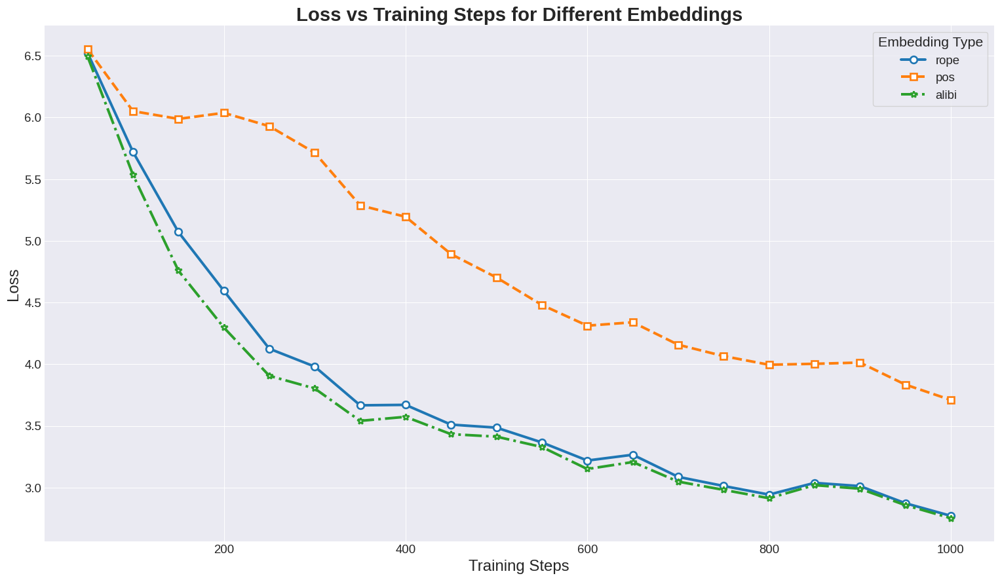
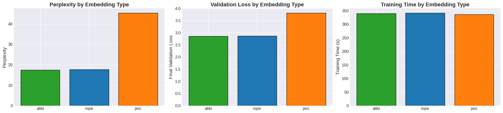

# Positional Embeddings Bench: APE vs RoPE vs ALiBi

Train a small LLaMA-style language model on TinyStories and compare three positional encodings:

- **pos** – Absolute sinusoidal (APE)
- **rope** – Rotary Position Embedding
- **alibi** – Attention with Linear Biases

This repo contains a minimal training script and implementations packaged under `llama/`. It logs metrics, saves checkpoints, and (optionally) reproduces the figures from the blog post.




---

## 📦 Repo structure

```

.
├── data/                      # place prepared data here
│   └── tinystories/
│       ├── train.txt
│       └── validation.txt
├── llama/                     # model + embedding implementations
├── outputs/
│   ├── checkpoints/           # auto-created by the trainer
│   └── logs/                  # auto-created by the trainer
├── train.py                   # main training script
├── train_utils.py             # checkpoint + config helpers
├── data.py                    # DataLoader for plain-text datasets
├── training_loss.png          # example result
└── validation_results.png     # example result

````

---

## 🧰 Prerequisites

- Python **3.9–3.12**
- PyTorch (CUDA, MPS, or CPU)
- A few lightweight libraries

Install everything in a fresh virtual environment:

```bash
python -m venv .venv
# Windows: .venv\Scripts\activate
source .venv/bin/activate

# Install PyTorch first (pick the right command for your machine from pytorch.org),
# then the Python deps used in this repo:
pip install -r requirements.txt
````

### Dataset: TinyStories (Hugging Face)

This repo expects plain-text files at:

- `data/tinystories/train.txt`
- `data/tinystories/validation.txt`

You can pull the dataset from Hugging Face ([`roneneldan/TinyStories`](https://huggingface.co/datasets/roneneldan/TinyStories)) and export the two splits like this:

```bash
python - <<'PY'
from pathlib import Path
from datasets import load_dataset

out_dir = Path("data/tinystories")
out_dir.mkdir(parents=True, exist_ok=True)

ds = load_dataset("roneneldan/TinyStories")

def write_split(split_name: str, out_path: Path) -> None:
    # Match this repo's DataLoader convention: docs separated by <|endoftext|>
    with out_path.open("w", encoding="utf-8") as f:
        for row in ds[split_name]:
            f.write(row["text"].strip())
            f.write("\n<|endoftext|>\n")

write_split("train", out_dir / "train.txt")
write_split("validation", out_dir / "validation.txt")
print("Wrote:", out_dir / "train.txt")
print("Wrote:", out_dir / "validation.txt")
PY
````

> The trainer auto-detects device: `cuda` → `mps` (Apple Silicon) → `cpu`.

---

## 🚀 Training

`train.py` exposes a simple CLI:

```
usage: train.py --embedding {alibi,rope,pos} [options]

required:
  --embedding {alibi,rope,pos}   Which positional encoding to use

optional:
  --batch_size INT               Default: 16
  --max_steps INT                Default: 1000
  --log_interval INT             Default: 50
  --eval_interval INT            Default: 500
  --save_interval INT            Default: 1000
  --output_dir PATH              Default: outputs
  --seed INT                     Default: 42
```

Examples:

```bash
# RoPE
python train.py --embedding rope --batch_size 32 --max_steps 1000

# ALiBi
python train.py --embedding alibi --batch_size 32 --max_steps 1000

# Absolute sinusoidal (APE)
python train.py --embedding pos --batch_size 32 --max_steps 1000
```

The script will:

* detect device (CUDA/MPS/CPU),
* build a LLaMA-style model + config (`llama/`),
* stream batches from `data/tinystories/*` via `data.DataLoader`,
* train with `AdamW(lr=3e-4, weight_decay=0.1)`,
* log metrics and save checkpoints.

Mixed precision (`torch.amp.autocast`) is used on CUDA/MPS automatically.

---

## 📁 Outputs

Everything goes under `outputs/`:

```
outputs/
├── checkpoints/
│   ├── {embedding}_step_{N}.pt      # periodic checkpoints
│   └── {embedding}_best.pt          # best val-loss checkpoint
└── logs/
    ├── training_{embedding}_{TS}.log
    ├── metrics_{embedding}_{TS}.json
    └── config_{embedding}_{TS}.json
```

* **`training_*.log`**: human-readable log lines (loss, evals, paths).
* **`metrics_*.json`**: step-wise JSON records; each entry looks like:

  ```json
  {"step": 500, "timestamp": "2025-08-17T12:34:56",
   "train_loss": 3.72, "val_loss": 3.29, "perplexity": 26.7}
  ```
* **`config_*.json`**: the exact model/training config used for that run.

---

> The repo already includes `training_loss.png` and `validation_results.png` from a reference run on TinyStories (28M params, 4 heads, 4 layers, 256 ctx/emb, 1000 steps, batch 32 on M2).

---


## 🪪 License

This project is for educational and research use. See `LICENSE` if included in your copy of the repo.